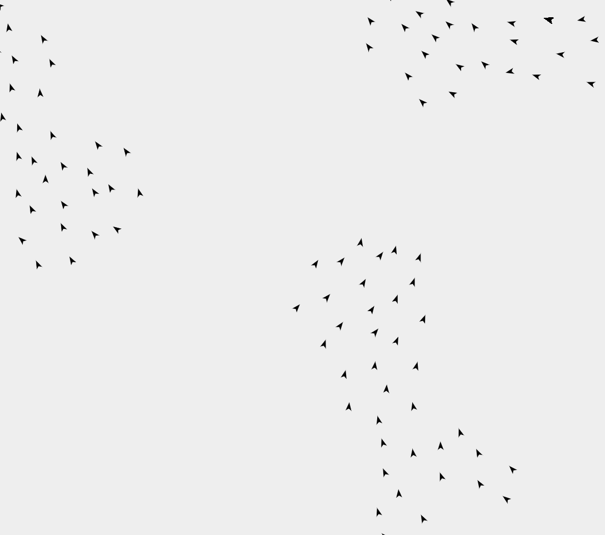

# Flocking2D
A simulation of a swarm of 2D objects displaying flocking behavior.

Based on the paper __[Flocks, Herds, and Schools: A Distributed Behavioral Model](https://team.inria.fr/imagine/files/2014/10/flocks-hers-and-schools.pdf)__ by _Craig W. Reynolds_.

## [Demo](https://laxel.github.io/)

# Installation
* Clone the repository
```
git clone https://github.com/laxel/Flocking2D.git
```
* Open the file index.html with the browser of your choice
